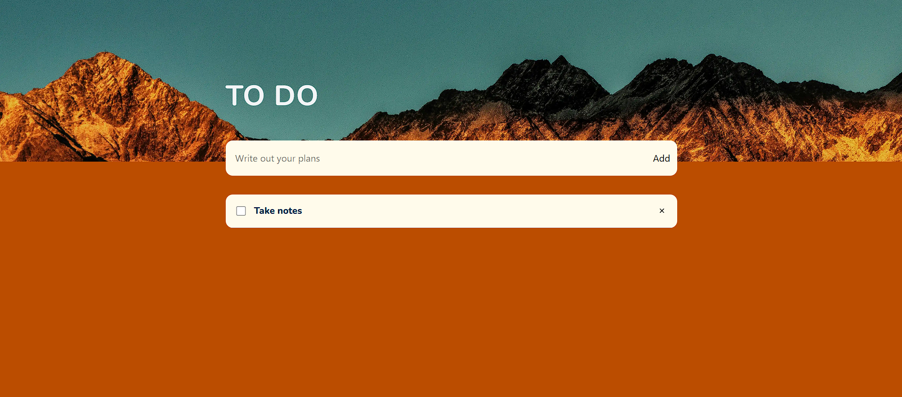

# To-Do List App ✅

A simple and responsive to-do list application where users can add, check, and delete tasks. The app is built with React and uses Context API for state management.

## Features
- ➕ Add new tasks  
- ☑️ Mark tasks as completed  
- 🗑️ Delete tasks  
- 📱 Responsive design for all devices  
- 🔄 State shared across components with Context API  

## Tech Stack
- **React**  
- **JavaScript (ES6+)**  
- **Context API**  
- **CSS / Tailwind (if you used it)**

## Screenshots

### Desktop View

### Mobile View

## Installation & Setup
1. Clone the repository:
   git clone https://github.com/yourusername/todo-list-app.git
2. Navigate to the project folder:
   cd todo-app
3. Install dependencies:
   npm install
4. Run the development server:
   npm run dev
